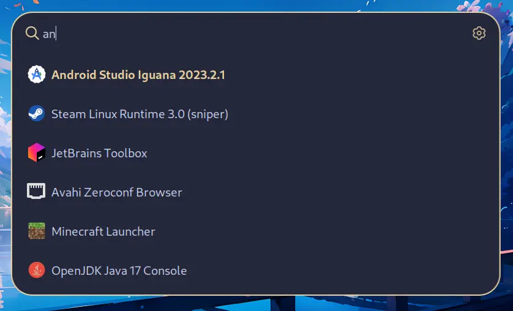
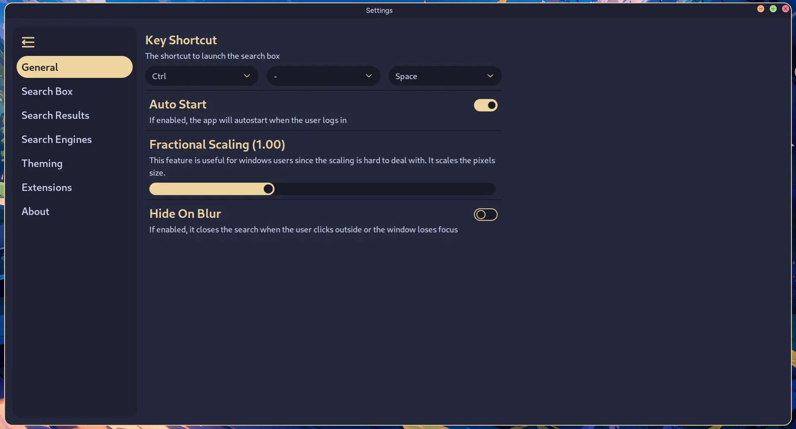
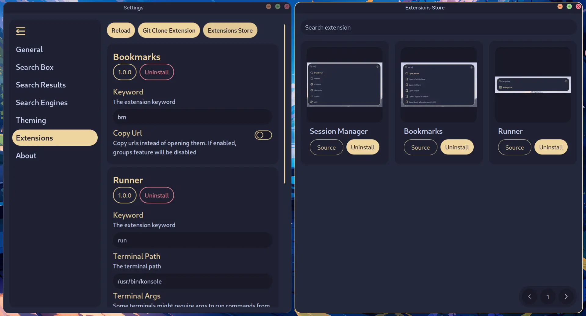
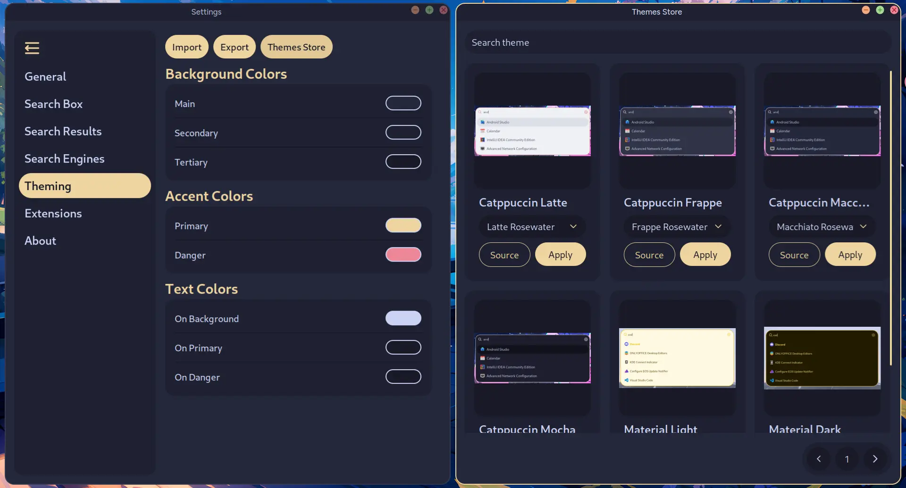
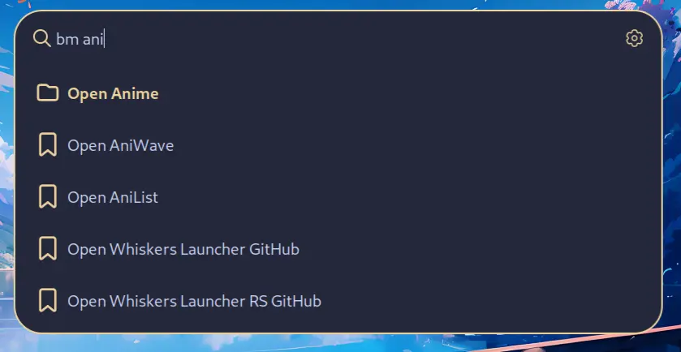

<div align="center">
  

  # Whiskers Launcher
</div>

# About
Whiskers Launcher is very clean, customizable launcher for Linux and Windows. It supports extensions and multiple themes. 
The launcher is still a work in progress and will slowly get better with time. Right now the launcher is probably not wayland ready since
i can't have a proper experience to daily drive it.

# Screenshots
<details>
  <summary>Click to see screenshots</summary>

  <div align="center">
    <br>
    <p>Search</p>
    
    <br>
    <p>Settings</p>
    
    <br>
    <p>Extensions</p>
    
    <br>
    <p>Themes</p>
    
    <br>
    <p>Bookmarks Extension</p>
    
  </div>
</details>

# Installation
### Linux
#### Dependencies
<details>
  <summary>Arch Linux Dependencies</summary>
  
    sudo pacman -S --needed webkit2gtk base-devel curl wget file openssl appmenu-gtk-module gtk3 libappindicator-gtk3 librsvg libvips xdotool

</details>

<details>
  <summary>Debian/Ubuntu Dependencies</summary>
  
    sudo apt install libwebkit2gtk-4.0-dev build-essential curl wget file libssl-dev libgtk-3-dev libayatana-appindicator3-dev librsvg2-dev libxdo-dev

</details>

1. Download the zip file in [releases](https://github.com/lighttigerXIV/whiskers-launcher/releases) page (Linux-Whiskers-Launcher)
2. Extract It
3. Open the terminal inside the folder and run `./install`
### Windows
1. Download the zip file in [releases](https://github.com/lighttigerXIV/whiskers-launcher/releases) page (Windows-Whiskers-Launcher)
2. Extract It
3. Run the ```install.exe``` as administrator

# Uninstall
To uninstall the app, simply run the uninstall script, the same way as the installation process.

## Extensions
#### Extensions Repository
The app supports extensions. You can download them through the app or explore the [repository](https://github.com/lighttigerXIV/whiskers-launcher-extensions) where they are all listed.
#### Making Extensions
You can follow the documentation [here](https://whiskers-launcher-docs-mdbook.vercel.app/extensions/how-it-works.html)

## Themes
#### Themes Repository
The app supports ccustom themes. You can download them through the app or explore the [repository](https://github.com/lighttigerXIV/whiskers-launcher-themes) where they are all listed.
#### Making Themes
You can follow the documentation [here](https://whiskers-launcher-docs-mdbook.vercel.app/themes/exporting.html)

# Contributing
You can help the project by reporting bugs, suggesting features, making themes and extensions and maybe translations in the future.

