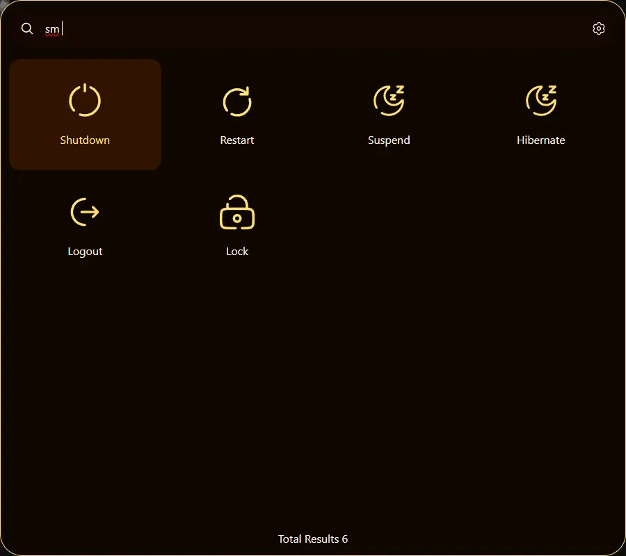

# About
Whiskers Launcher is a keyboard app launcher for 🐧Linux and 🪟Windows that aims to be easily customizable and support extensions. 
The app is built in 🦀 rust and svelte using tauri to get the best possible performance (as a web app). 
This app was born to fill the gap between a good launcher that supports Linux and Windows.

## Screenshots



# Install
## Dependencies
If you are using linux, the program requires a few dependencies.
<details>
  <summary>Arch Linux</summary>
  
```
sudo pacman -S --needed webkit2gtk base-devel curl wget file openssl appmenu-gtk-module gtk3 libappindicator-gtk3 librsvg libvips xdotool
```
</details>

<details>
  <summary>Fedora</summary>
  
```
sudo dnf install webkit2gtk4.0-devel openssl-devel curl wget file libappindicator-gtk3-devel librsvg2-devel libxdo
sudo dnf group install "C Development Tools and Libraries"
```
</details>

## Install
- Go to the [releases](https://github.com/Whiskers-Apps/whiskers-launcher/releases) and download the appropriate package for your platform.
- Extract the file.
- Run the install script.

## Uninstall
- Run the uninstall script located on the release dir you previously downloaded.

# Wiki
To know how to develop an extension or theme and how to publish them you can check out the [wiki](https://github.com/Whiskers-Apps/whiskers-launcher/wiki)

# Contributors
The people that have contributed to the project.

<a href="https://github.com/whiskers-apps/whiskers-launcher/graphs/contributors">
  
</a>
